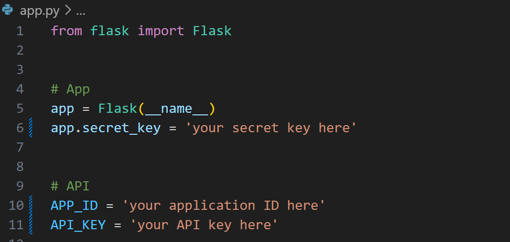
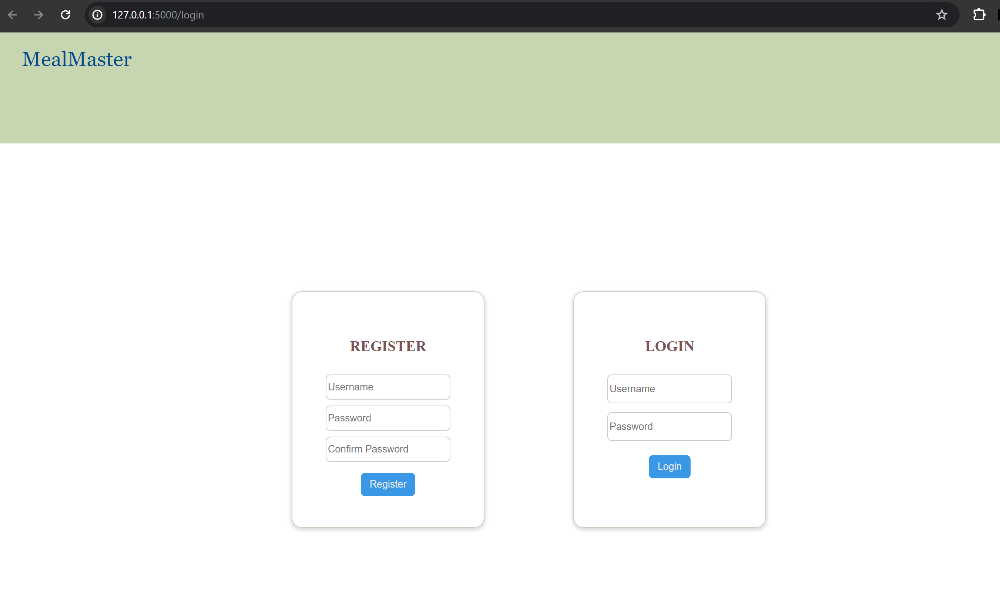
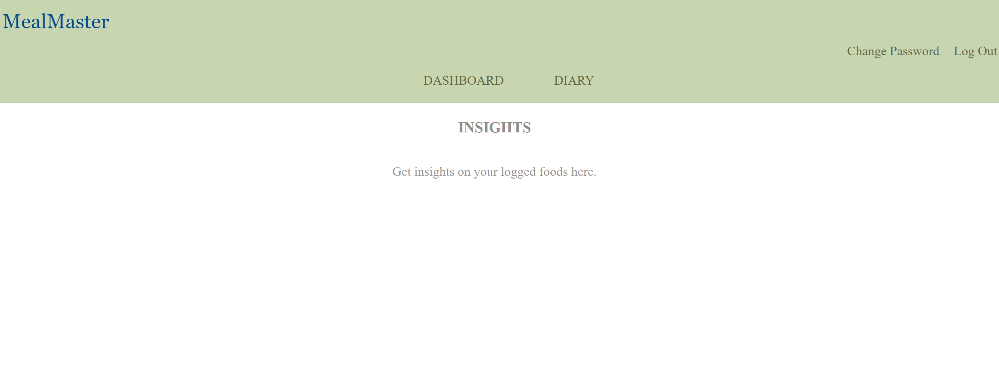
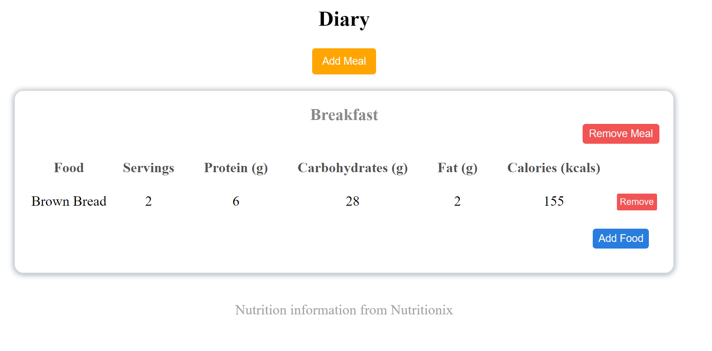
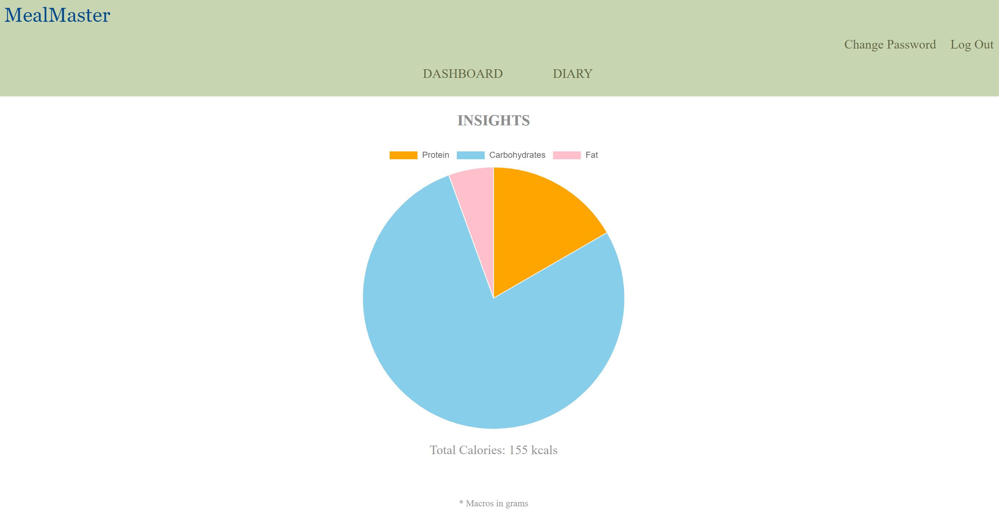
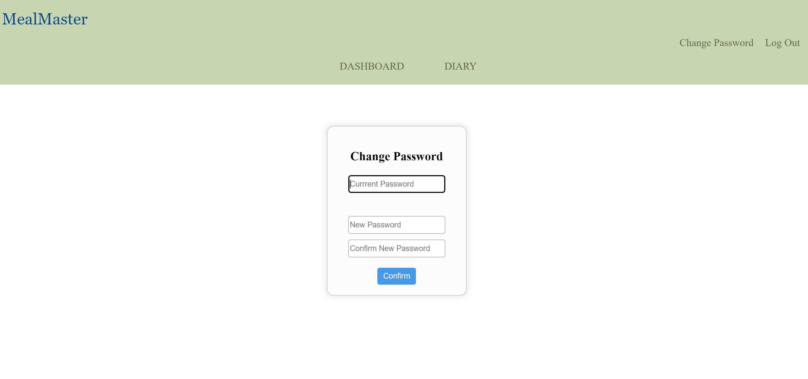

# MealMaster
#### Video Demo: https://youtu.be/hb8rzgyBZlc

## Description
MealMaster is a web application that allows you to log foods you've consumed and get info on their nutrients.

## About the Project
The project utilizes a variety of tools. The backend for the application is built using Python's Flask framework, while HTML, CSS, and JavaScript are used for the frontend. SQLite, which comes prepackaged with Python, is used as the database for the application. The application utilizes Jinja templating to render templates as the user visits different routes within the application.

## Getting Started
### Installing Python
Make sure that you have Python 3.12.2 or a later version installed on your device. You can install Python by downloading it through Python's official website.

1. Visit the [official Python website](https://www.python.org/).
2. Click on the "Downloads" tab.
3. Select your operating system (Windows, macOS, or Linux).
4. Download the installer and follow the instructions to complete the installation.

#### Verifying the Installation
After installing Python, you can verify the installation by running the following command in your terminal or command prompt:
```
python --version
``` 

### Installing Project Dependencies
The different requirements for this project have been listed in [requirements.txt](requirements.txt). You can install them through Python's *pip* package manager. Python versions 2.7.9 and later, as well as 3.4 and later, include *pip* by default.

You can install the dependencies listed in [requirements.txt](requirements.txt) through the following steps:

1. **Navigate to the project directory**:
    - Use the `cd` command to navigate to the directory.
2. **Install Dependencies**:
    - Run the following command to install all the dependencies listed in `requirements.txt`:
    ```sh
     pip install -r requirements.txt
     ```

### Getting Nutritionix's API Key
The application utilizes Nutritionix's **Natural Language for Nutrients** API to fetch nutrient information. You need to sign up for your API key first in order to access the API Endpoint. Go through the following steps to get your API Key:
1. Sign up for Nutritionix's API Key from [developer.nutritionix.com](https://developer.nutritionix.com/signup).
2. Log in to your developer account through [https://developer.nutritionix.com/login](https://developer.nutritionix.com/login).
3. Note your **Application ID** and **Application Keys**, which you will later use in the application to authenticate yourself when making an API request.

### Setting up **app.py**
In **`app.py`**, set up `app.secret_key`, a secret key for your Flask application, `APP_ID`, your *Application ID* for Nutritionix's API, and `API_KEY`, your *Application Key* for the API.


That's it. The application is all set up now and should function as intended.


## Usage
### Running the application
Once the application is set up, open a terminal and navigate to the directory the project is in. In the terminal, use `flask run` to run the application. The application will run with your device as the server. You can access the application by visiting http://127.0.0.1:5000, or clicking on the link that is output on your terminal.

### Registration and Login
Once you run the application, you're taken to the login page. Here, you can either register as a new user, or if you have done so already, login to your account. 



### Dashboard
Once you have successfully registered yourself and log in, you're redirected to your **Dashboard**. For now, there won't be much on this page, however, once we start adding some food, it'll display some handy insights!



### Diary
#### Adding a  meal
Now, lets visit the **Diary** page by clicking on the `Diary` button in the navigation bar. Once you're at this page, you can add a meal by clicking on the `Add Meal` button. Enter a name for your meal and hit `Submit` to add in a new meal.

Once the meal is added, you'll get a message saying 'Food added successfully.'

#### Adding a food

Once your meal is added, you can add foods to your meal by clicking on the `Add Food` button. Upon clicking this button, you'll be asked the name of the food and the number of servings you wish to add.



Note that the application expects common food items, and may not be able to find some foods that are uncommon - such as a burger you had from a particular restaurant near your home - in which case, you may get a response that says the food was not found. Therefore, make sure to enter foods that are common.

Enter the number of servings of the food you're adding and hit the `Submit` button to enter the new food to your meal. The application assumes the serving size to be the same as the default serving size in Nutritionix's database.

You'll get a message saying 'Food added successfully!' once it's successfully added.

Note that an internet connection is required to add food.

#### Removing a meal or food

If you need to remove a food, click on the `Remove` button beside the food. This will remove that particular food from your meal.

If you want to delete a whole meal altogether, click on the `Remove Meal` button toward the top-right of your meal. This will delete the meal and all foods recorded within that meal.

Note that the **Remove** buttons function immediately, and won't ask you for a confirmation.

### Insights
Once you've logged some foods, you can get some insights on the different nutrient info on the foods you've added by visiting your **Dashboard**.



A pie chart displaying your macros, and the total amount of calories you have consumed will be displayed on this page.

### Changing your Password
You can change your login password by visiting the **Change Password** page, which can be accessed by clicking on the **`Change Password`** button on the page's header. 



Enter your current password, new password, and a confirmation for your new password. Once your password is changed successfully, you'll be redirected to the **Dashboard** page. Your new password will be required from the next time you log in.

### Logging out
Click on the **`Log Out'** button to log out. Your records are saved and can be accessed after you log in again.


### Stopping the application
To stop the application, hit the `Ctrl` and `C` keys on your keyboard if on a Windows machine, or `Cmd` and `C` if you're on macOS.